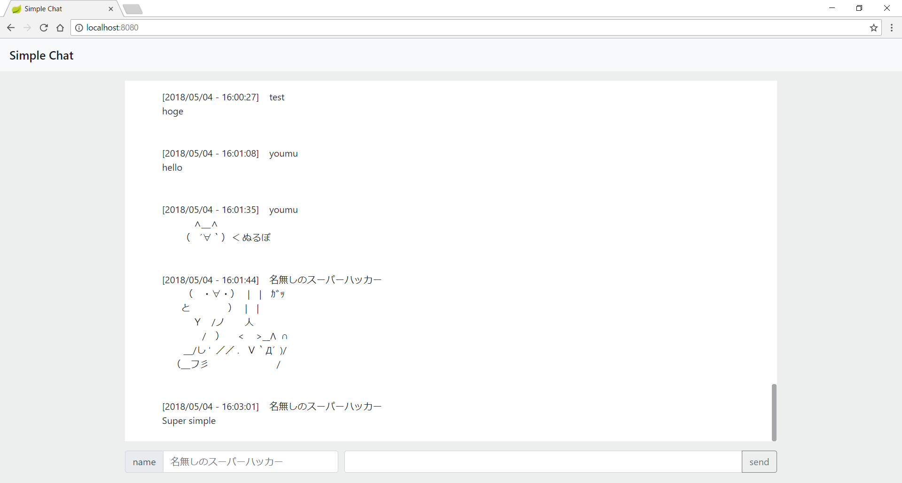
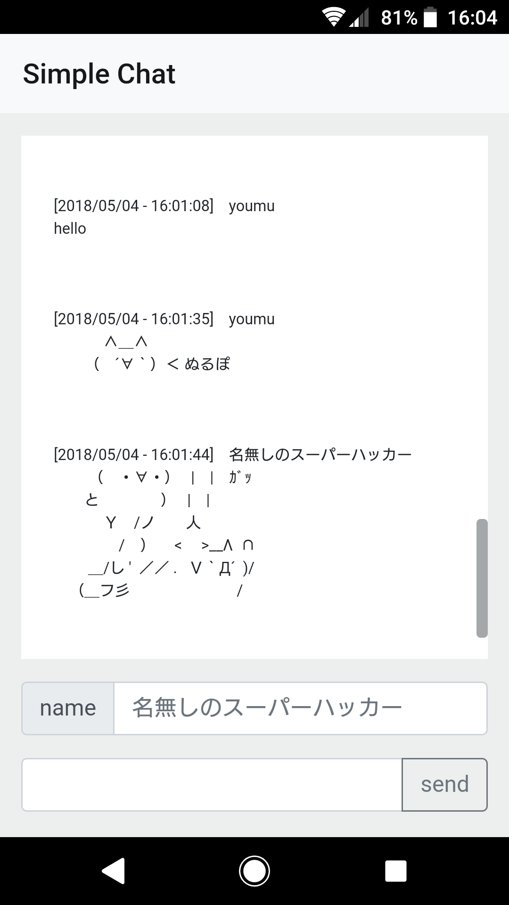

# Simple Chat






## Usage

1. Download SimpleChat.jar
2. Execute the following command
```
$ java -jar SimpleChat.jar
```
3. Access to`localhost:8080`


## Description

### Technology used
- Spring Boot
- STOMP over WebSocket
- jQuery
- Bootstrap
